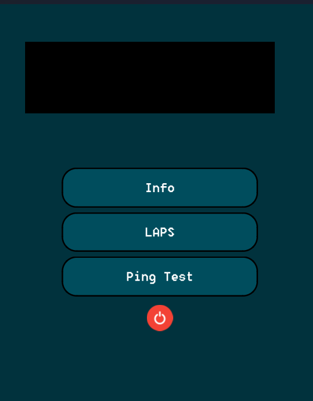
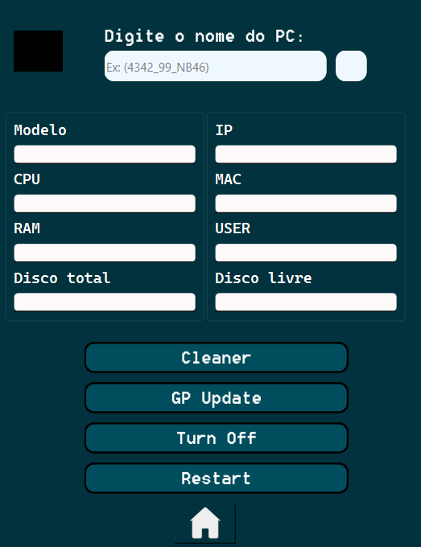
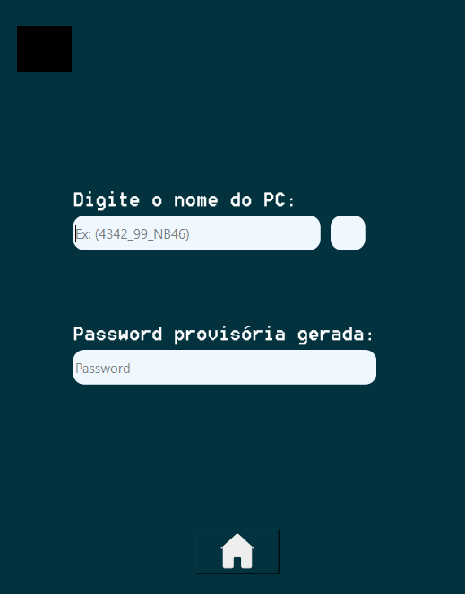
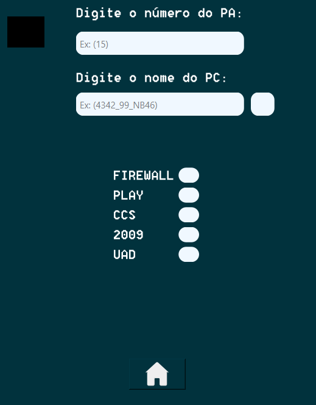

# SicoobSupportAPP

# MAIN MENU:

- HOVERS EXAMPLE:

             

 
# Section: INFO

In this section, can be used to show about some pc infos, like: 
- CPU; IP; MAC; CURRENT USER; TOTAL/FREE DISK SPACE; PC MODEL

  

For getting the values i used the library subprocess to execute commands and get their outputs, and sure i used the REGEX to extract what
i need in the output. (It was little bit challenging as it seems) 
**In the functions.py its how i made that. (and another things)

In this section, you can use the functions > CLEANER, GPUPDATE, SHUTDOWN -S, SHUTDOWN -R
CLEANER -> There is a script (.bat) that cleans the disk of the machines. In short: it deletes several files in the directories (like: temp, cachedirs, tempfiles of the company system, etc.....) and executes some additional commands to optimize the system. That .bat file is located in \Administrador\Documents. So the program copies this file to the PC where the cleaning will be performed.
  

# Section: LAPS

Maybe not everyone knows about LAPS -> its a password generated for the local admin user.
First, type the PC NAME and then start the getpassword method (functions.py). Using regex, it will extract just the password from the PowerShell command output.

# Section: Ping

Option 1, Type the PA number.
The function will load the JSON file that stores the list in this format: PA01: '10.1.1.1.1.1'.
Then, it will ping the IP address.
If the IP address is correct, the firewall checkbox will turn green; otherwise, it will turn red.

Option 2, Type the pc name to connect him and execute ping.
**why pc? Because we need to check connection of PA with CCS, CENTRAL, UAD, etc.

